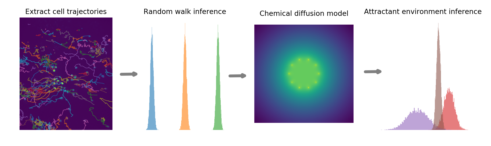

# immue-cell-migration-models

This is a repository holding the code relevant for my masters dissertation at Edinburgh University entitled "A Cell-Tracking Tool for Analysing Cell Behaviour During Wound Repair". The purpose is to use in-vivo images of white blood cells migrating towards a wound in the wing of a fruit fly, and to build a model for this motion with the aim of inferring infomation about the chemical environment. 




## Instructions for running with docker

To explore this project via the code in the notebooks folder run the following: 

```
git clone https://github.com/nickelnine37/immue-cell-migration-models.git
cd immue-cell-migration-models
docker build -t diss .
docker run -p 8888:8888 diss
```

This may take around 5 minutes and use up ~1.5GB of space. To reduce space and increase build time, remove the following line in the dockerfile

```
RUN apt update && apt install -y ffmpeg
```

This will remove the ability to create mp4 videos in notebook 4, but all other functionality will remain. 

